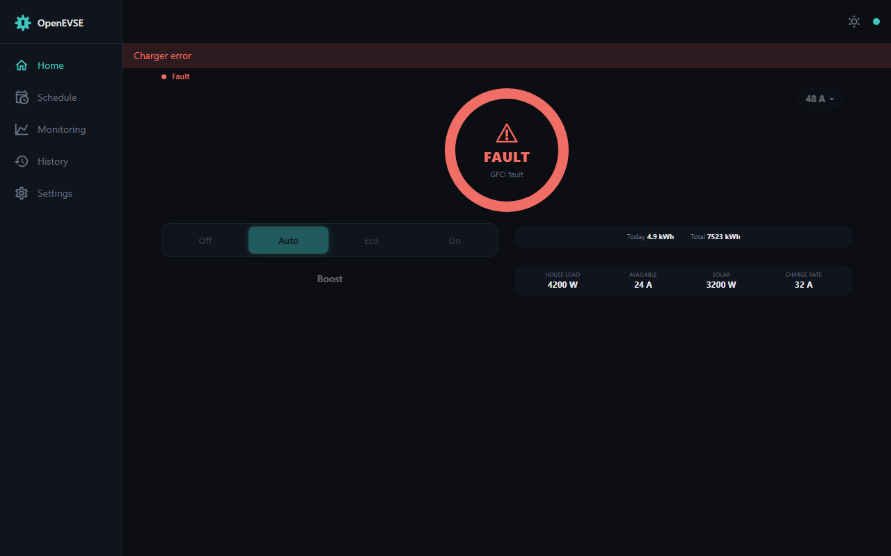
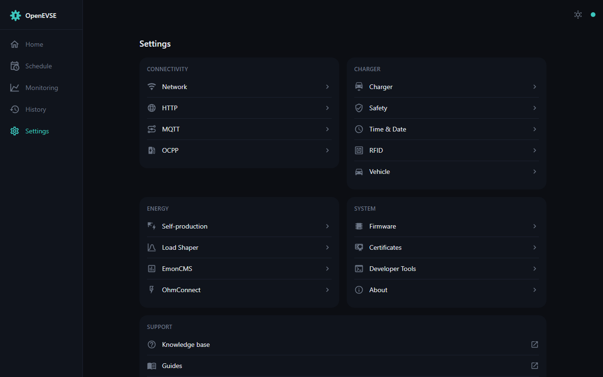
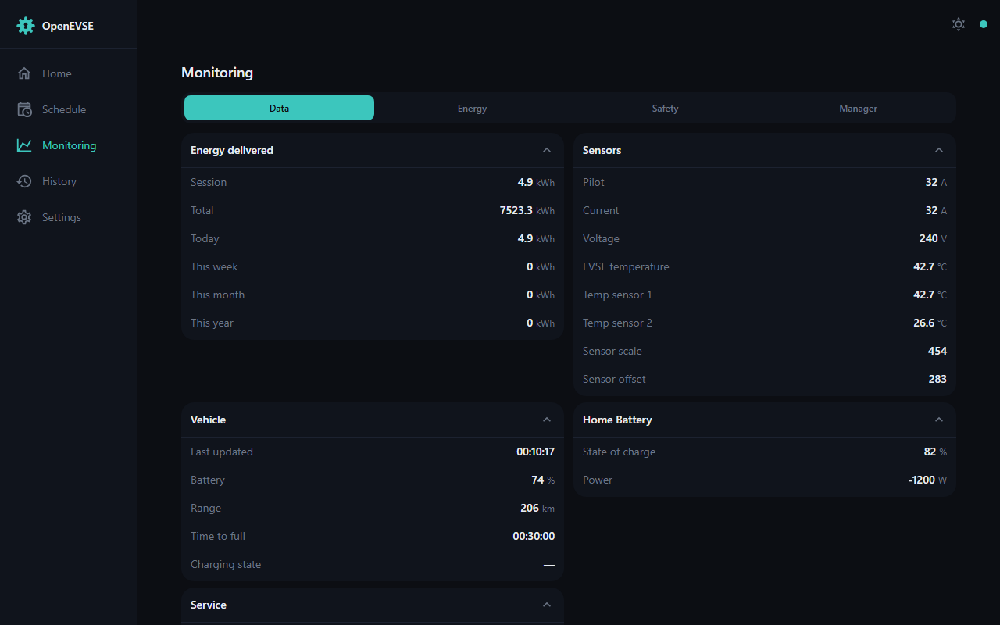
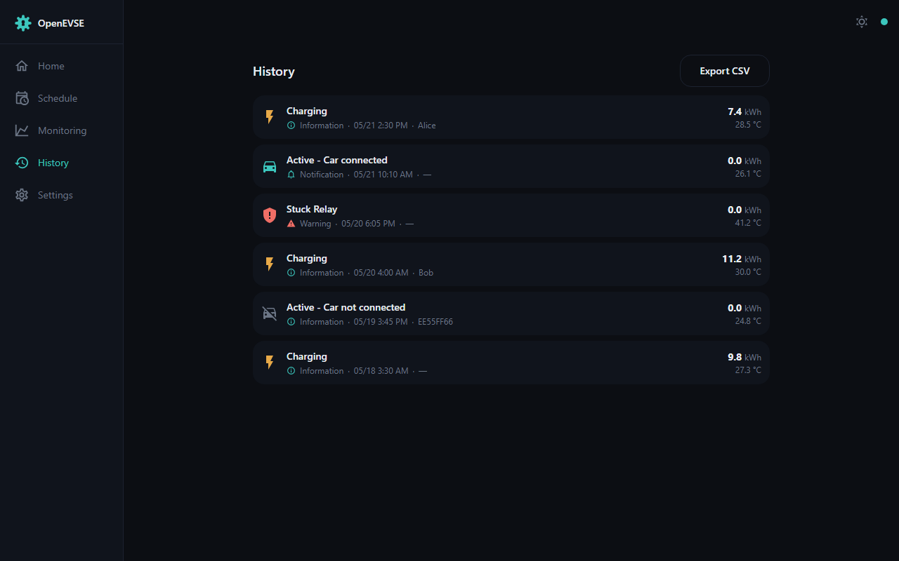

# openevse-gui-nightshift

A replacement web UI for the [OpenEVSE](https://www.openevse.com/) WiFi module —
a from-scratch rewrite built with **Svelte 5, Vite 8 and Tailwind 4**.

The app is a pure client of the OpenEVSE device's HTTP + WebSocket API; it has no
backend of its own. The production build is a small, gzipped static bundle intended
to be flashed onto the WiFi module and served from its embedded web server.

## Features

- **Dashboard** — live charge state, power ring, session stats, charge mode
  (Auto / On / Off), charge-rate and charge-limit controls.
- **Schedule** — recurring charge timers.
- **Monitoring** — live energy, sensor, service and vehicle metrics.
- **History** — the device event log.
- **Settings** — a hub plus 17 configuration pages: Network (incl. WiFi scan/join),
  HTTP, MQTT, OCPP, EVSE, Safety, Time, RFID, Vehicle (incl. Tesla login),
  Self-production, Load Shaper, EmonCMS, OhmConnect, Firmware (incl. GitHub online
  updates), Certificates, Terminal and About.
- **Four languages** — English, Spanish, French, Hungarian; the locale follows the
  browser and can be changed in Settings → HTTP.

## Screenshots

All screenshots are generated automatically with `npm run screenshots` (see
[Screenshots](#screenshots-1) below) — the full set, covering every screen and
settings page, lives in [docs/screenshots/](docs/screenshots/). The UI ships
light and dark themes — toggle from the header.

<table>
  <tr>
    <td width="50%"><br><sub>Dashboard — charging (dark)</sub></td>
    <td width="50%"><br><sub>Dashboard — charging (light)</sub></td>
  </tr>
  <tr>
    <td width="50%"><br><sub>Charger fault state</sub></td>
    <td width="50%"><br><sub>Settings hub</sub></td>
  </tr>
  <tr>
    <td width="50%"><br><sub>Monitoring</sub></td>
    <td width="50%"><br><sub>History</sub></td>
  </tr>
</table>

## Requirements

- Node.js 20+ and npm.

## Quick start

```bash
npm install
npm run dev:mock      # run the UI offline against built-in mock data
```

Open the printed URL — no hardware required.

## Develop

### Against a real device

Point the dev server at a charger by setting `VITE_OPENEVSEHOST` in a `.env` file
(copy `.env.example`; default `openevse.local`):

```bash
cp .env.example .env        # then edit VITE_OPENEVSEHOST, e.g. 10.75.1.144
npm install
npm run dev
```

Vite proxies `/api`, `/ws`, `/debug` and `/evse` to that host, so the dev UI talks
to live hardware.

### Mock mode (no hardware needed)

```bash
npm run dev:mock
```

This starts Vite in `mock` mode. A built-in plugin intercepts every `/api/*` request
with canned fixture data and serves a mock `/ws` WebSocket that pushes live-looking
status updates every 2 seconds. No `VITE_OPENEVSEHOST` and no proxy are needed.

Fixture files live in `dev/fixtures/` and can be edited to simulate different device
states (e.g. set `state` in `status.json` to `1` for standby or `3` for charging).
Note: the mock serves reads only — it does not accept config writes, so Settings-page
saves report a write error in mock mode. They work against a real device.

Two dev-only endpoints switch the simulated device at runtime, no restart needed:

- `GET /api/_mock/state/<code>` — flip the EVSE state (1 idle, 2 connected,
  3 charging, 4+ fault, 254 sleeping, 255 off; `reset` returns to the fixture).
- `GET /api/_mock/scenario/<name>` — overlay `dev/fixtures/scenarios/<name>.json`
  onto the base fixtures (`reset` clears). A scenario file holds partial fixture
  objects keyed by fixture stem, e.g. `{ "config": { "wizard_passed": false } }`
  re-enables the first-run wizard.

Setting `MOCK_STATIC=1` freezes the mock completely (no WebSocket ticks, fixed
server clock) — this is what the screenshot generator uses.

### Docker (emulator — no hardware needed)

A `docker-compose.yml` is included that spins up a complete development
environment with no hardware required:

| Service | Container | Host port |
|---------|-----------|-----------|
| Vite dev server (UI) | `node:22-alpine` | [http://localhost:5173](http://localhost:5173) |
| OpenEVSE native firmware | `ghcr.io/openevse/openevse-wifi-native:latest` | [http://localhost:8000](http://localhost:8000) |
| OpenEVSE emulator HTTP UI | `ghcr.io/jeremypoulter/openevse_emulator:latest` | [http://localhost:8080](http://localhost:8080) |

The services start in dependency order — emulator first (waits until its RAPI TCP
port 8023 is healthy), then the native firmware, then the UI (waits until the
firmware HTTP API on port 8000 responds).

```bash
docker compose up
```

Open [http://localhost:5173](http://localhost:5173). Source files are bind-mounted
so edits hot-reload exactly as with the local `npm run dev` workflow.

## Build

```bash
npm run build         # static, gzipped output in dist/ — ready to flash
npm run preview       # serve the production build locally
```

## Test

```bash
npm test              # run the full suite once
npm run test:watch    # re-run on change
npm run test:coverage # with a coverage report
```

Tests use Vitest and `@testing-library/svelte`. Coverage is scoped to the pure logic
in `src/lib/**/*.js`.

## Screenshots

```bash
npm run screenshots                          # regenerate docs/screenshots/*.png
node scripts/screenshots.mjs --only dashboard-charging,settings   # a subset
```

Every image in `docs/screenshots/` is generated headlessly from mock mode —
no hardware, deterministic output (frozen clock, fixed locale/timezone/viewport,
animations disabled), so an unchanged UI reproduces byte-identical files.
The manifest in `scripts/screenshots.config.js` declares each capture (route,
scenario, EVSE state, themes, viewports); add an entry there when adding a screen.
Regenerate and commit the images whenever a UI change alters them.

## Project layout

```
src/
  routes/            page components (one per screen); routes/settings/ = config pages
  lib/
    components/      ui/ (primitives), config/, plus per-screen component folders
    stores/          Svelte stores — the device API client layer
    config/          pure config-page logic (validators, helpers) — unit-tested
    data/            WebSocket / FetchData / DataManager — the live data layer
    i18n/            en / es / fr / hu translation files
    routes.js        the exact-match route table
dev/
  mock-plugin.js     the mock-mode Vite plugin
  fixtures/          canned device responses for mock mode
    scenarios/       named fixture overlays (wizard, display, ...)
scripts/
  screenshots.mjs    automated screenshot generator (npm run screenshots)
  screenshots.config.js  the capture manifest
docs/screenshots/    generated UI screenshots — do not edit by hand
docs/superpowers/    design specs and implementation plans
```

Architecture in brief: the route component is the only store-aware unit; pure logic
lives in `src/lib/` modules and is unit-tested; device writes are serialised through a
single queue (the device's web server is single-threaded).

Other scripts: `npm run icons` regenerates the PWA icon set.

## License

GPL-3.0-or-later. See [LICENSE](LICENSE).
